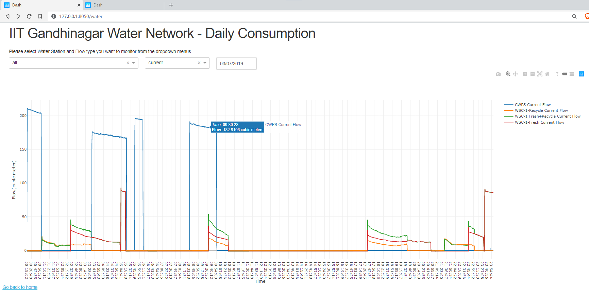
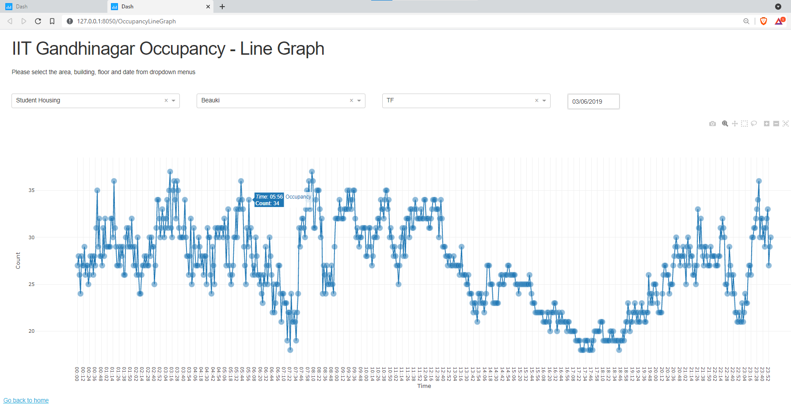
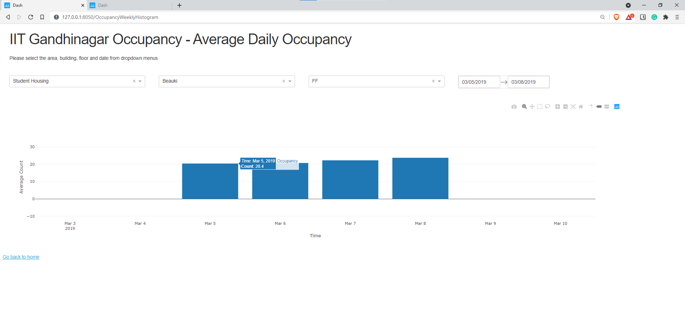

# Water Systems @IIT Gandhinagar

## Project contains code for 
1. Data collection from Water sensors and Wifi Logs
2. Web server for visualising Water Flow and Occupancy at IIT Gandhinagar using Plotly and Dash

The repo contains demo data from March 2019 for testing purpose.

## Screens 

#### This screen plots the water flow from Water Treatment Plants at IIT Gandhinagar

#### This screen plots the Occupancy in given Area for the given day with frequency of data collection between every 4 to 6 minutes

#### This screen plots the Average Occupancy in given Area for the given range of dates

## Instructions to run the Server

Run the index.py program inside the "Dash Server" folder. 

Install the dependencies from the requirements.txt file